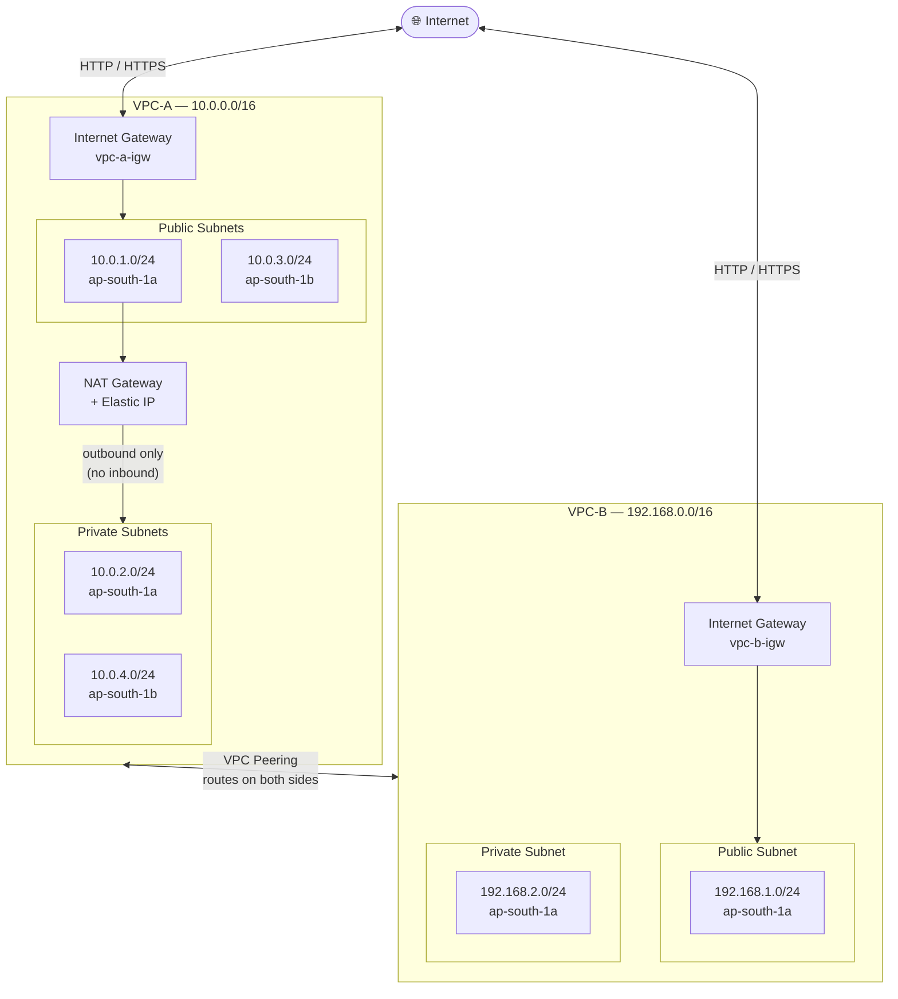
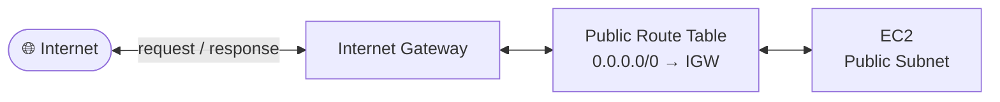
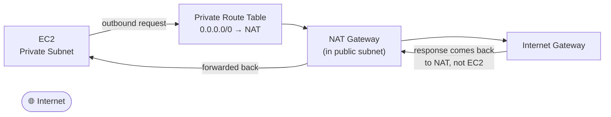
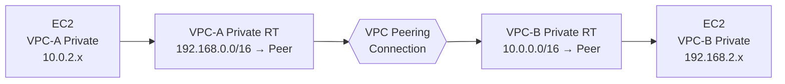
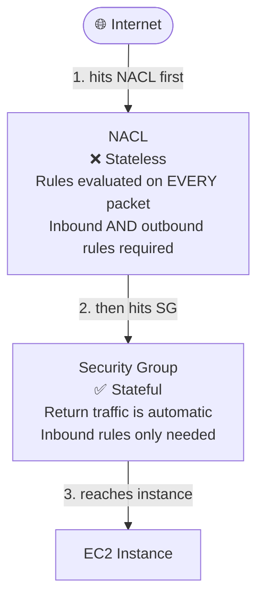
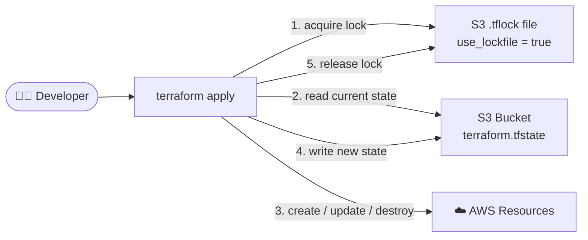
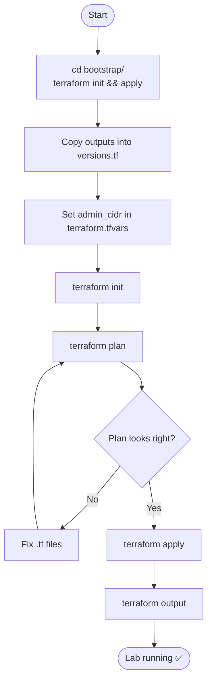

# terraform-aws-vpc-lab

A fully modular Terraform lab for mastering AWS VPC networking — two peered VPCs covering every core concept: IGW, NAT, route tables, NACLs, security groups, and VPC peering. Everything controlled from a single `terraform.tfvars`.

---

## Network Architecture



---

## Traffic Flows

### Public subnet — inbound + outbound via IGW



### Private subnet — outbound only via NAT



> NAT translates the private IP to its Elastic IP on the way out, and back on the way in. The internet never sees your private EC2 IP.

### VPC peering — private to private



> Peering alone is not enough — routes must be added on **both** route tables or traffic is dropped.

---

## Packet Flow Diagrams

Think of packets like letters in the postal system. Each route table is a post office — it checks the destination address and decides where to forward the letter next.

---

### Full network diagram — every device with its interface

Every box below shows the device name, its interface (like eth0 from PowerCert),
and the IP address bound to that interface.

```
                                   🌐 INTERNET
                                         │
                    ┌────────────────────┴─────────────────────┐
                    │                                           │
             [igw-vpc-a]                                 [igw-vpc-b]
             Internet Gateway                            Internet Gateway
                    │                                           │
 ┌──────────────────┴─────────────────────────┐   ┌────────────┴──────────────────────────┐
 │  VPC-A   10.0.0.0/16                        │   │  VPC-B   192.168.0.0/16               │
 │                                             │   │                                        │
 │  ┌──────────────────────────────────────┐   │   │  ┌──────────────────────────────────┐  │
 │  │  PUBLIC SUBNETS                      │   │   │  │  PUBLIC SUBNET                   │  │
 │  │                                      │   │   │  │  192.168.1.0/24  (ap-south-1a)   │  │
 │  │  ┌────────────────────────────────┐  │   │   │  │  ┌────────────────────────────┐  │  │
 │  │  │  10.0.1.0/24  (ap-south-1a)    │  │   │   │  │  │ [EC2]                      │  │  │
 │  │  │  ┌──────────────────────────┐  │  │   │   │  │  │  eth0: 192.168.1.x         │  │  │
 │  │  │  │ [EC2]                    │  │  │   │   │  │  │  + public EIP (via igw-b)  │  │  │
 │  │  │  │  eth0: 10.0.1.55         │  │  │   │   │  │  └────────────────────────────┘  │  │
 │  │  │  │  + public EIP (via igw-a)│  │  │   │   │  └──────────────────────────────────┘  │
 │  │  │  └──────────────────────────┘  │  │   │   │                                        │
 │  │  │  ┌──────────────────────────┐  │  │   │   │  ┌──────────────────────────────────┐  │
 │  │  │  │ [NAT GW]                 │  │  │   │   │  │  PRIVATE SUBNET                  │  │
 │  │  │  │  eth0: 10.0.1.x          │  │  │   │   │  │  192.168.2.0/24  (ap-south-1a)   │  │
 │  │  │  │  EIP:  43.205.x.x        │  │  │   │   │  │  ┌────────────────────────────┐  │  │
 │  │  │  └──────────────────────────┘  │  │   │   │  │  │ [EC2]                      │  │  │
 │  │  └────────────────────────────────┘  │   │   │  │  │  eth0: 192.168.2.x         │  │  │
 │  │                                      │   │   │  │  │  ❌ no public IP            │  │  │
 │  │  ┌────────────────────────────────┐  │   │   │  │  │  ❌ no internet access     │  │  │
 │  │  │  10.0.3.0/24  (ap-south-1b)    │  │   │   │  │  └────────────────────────────┘  │  │
 │  │  │  ┌──────────────────────────┐  │  │   │   │  └──────────────────────────────────┘  │
 │  │  │  │ [EC2]                    │  │  │   │   └────────────────────────────────────────┘
 │  │  │  │  eth0: 10.0.3.x          │  │  │   │
 │  │  │  │  + public EIP (via igw-a)│  │  │   │
 │  │  │  └──────────────────────────┘  │  │   │
 │  │  └────────────────────────────────┘  │   │
 │  └──────────────────────────────────────┘   │
 │                      ▲                      │
 │                      │ outbound only        │
 │  ┌───────────────────┴──────────────────┐   │
 │  │  PRIVATE SUBNETS                     │   │
 │  │                                      │   │
 │  │  ┌────────────────────────────────┐  │   │
 │  │  │  10.0.2.0/24  (ap-south-1a)    │  │   │
 │  │  │  ┌──────────────────────────┐  │  │   │
 │  │  │  │ [EC2]                    │  │  │   │
 │  │  │  │  eth0: 10.0.2.55         │  │  │   │
 │  │  │  │  ❌ no public IP         │  │  │   │
 │  │  │  └──────────────────────────┘  │  │   │
 │  │  └────────────────────────────────┘  │   │
 │  │  ┌────────────────────────────────┐  │   │
 │  │  │  10.0.4.0/24  (ap-south-1b)    │  │   │
 │  │  │  ┌──────────────────────────┐  │  │   │
 │  │  │  │ [EC2]                    │  │  │   │
 │  │  │  │  eth0: 10.0.4.x          │  │  │   │
 │  │  │  │  ❌ no public IP         │  │  │   │
 │  │  │  └──────────────────────────┘  │  │   │
 │  │  └────────────────────────────────┘  │   │
 │  └──────────────────────────────────────┘   │
 └─────────────────────────────────────────────┘
                    │                                           │
                    └──────────── pcx-vpc-a-to-b ───────────────┘
                          VPC Peering Connection  (virtual — no eth0)
                          10.0.0.0/16  ◄──►  192.168.0.0/16
                          routes needed on BOTH sides
```

---

### Scenario A — Public EC2 reaches the internet

```
   ┌───────────────────────────────────────────────────────────┐
   │  [EC2]  eth0: 10.0.1.55  (VPC-A Public, 10.0.1.0/24)     │
   │  packet: src=10.0.1.55  dst=8.8.8.8 (Google DNS)         │
   └──────────────────────────┬────────────────────────────────┘
                              │
                              │ ① packet leaves eth0
                              ▼
   ┌───────────────────────────────────────────────────────────┐
   │  ROUTE TABLE — VPC-A Public                               │
   │                                                           │
   │  TYPE           NETWORK           INTERFACE               │
   │  ─────────────────────────────────────────────            │
   │  DIR.CONNECTED  10.0.0.0/16       local                   │
   │                 8.8.8.8 here? NO                          │
   │                                                           │
   │  STATIC         192.168.0.0/16    pcx-vpc-a-to-b          │
   │                 8.8.8.8 here? NO                          │
   │                                                           │
   │  STATIC         0.0.0.0/0         igw-vpc-a  ✅            │
   │                 catch-all — 8.8.8.8 matches              │
   └──────────────────────────┬────────────────────────────────┘
                              │
                              │ ② exit via INTERFACE: igw-vpc-a
                              ▼
   ┌───────────────────────────────────────────────────────────┐
   │  [igw-vpc-a]  Internet Gateway                            │
   │  maps EC2 eth0 private IP → public Elastic IP            │
   └──────────────────────────┬────────────────────────────────┘
                              │
                              │ ③ exits to internet
                              ▼
                       🌐 8.8.8.8 ✅

   Return trip (automatic):
   8.8.8.8 → reply to public EIP → igw-vpc-a maps back → eth0: 10.0.1.55
```

---

### Scenario B — Private EC2 downloads from the internet via NAT

Private EC2 (10.0.2.55) has **no public IP**. It cannot go directly to the internet.
NAT Gateway is the middleman — it goes to the internet on the EC2's behalf.

```
   ┌───────────────────────────────────────────────────────────┐
   │  [EC2]  eth0: 10.0.2.55  (VPC-A Private, 10.0.2.0/24)    │
   │  packet: src=10.0.2.55  dst=8.8.8.8                      │
   └──────────────────────────┬────────────────────────────────┘
                              │
                              │ ① packet leaves eth0
                              ▼
   ┌───────────────────────────────────────────────────────────┐
   │  ROUTE TABLE — VPC-A Private                              │
   │                                                           │
   │  TYPE           NETWORK           INTERFACE               │
   │  ─────────────────────────────────────────────            │
   │  DIR.CONNECTED  10.0.0.0/16       local        NO match   │
   │  STATIC         192.168.0.0/16    pcx-a-to-b   NO match   │
   │  STATIC         0.0.0.0/0         nat-vpc-a  ✅ matched    │
   └──────────────────────────┬────────────────────────────────┘
                              │
                              │ ② exit via INTERFACE: nat-vpc-a
                              ▼
   ┌───────────────────────────────────────────────────────────┐
   │  [NAT GW]  eth0: 10.0.1.x  (sits in public 10.0.1.0/24)  │
   │            EIP:  43.205.x.x                               │
   │                                                           │
   │  src: eth0 10.0.2.55 ──────────────────────────►         │
   │                              replaced with                │
   │  src: EIP  43.205.x.x  (internet sees this only)         │
   └──────────────────────────┬────────────────────────────────┘
                              │
                              │ ③ NAT now uses public RT: 0.0.0.0/0 → igw-vpc-a
                              ▼
   ┌───────────────────────────────────────────────────────────┐
   │  [igw-vpc-a]  Internet Gateway                            │
   └──────────────────────────┬────────────────────────────────┘
                              │
                              │ ④ exits to internet
                              ▼
                       🌐 8.8.8.8 ✅

   Return trip:
   8.8.8.8 → reply to 43.205.x.x (EIP) → [NAT GW] receives it
   → NAT translates back to eth0: 10.0.2.55 → EC2 gets the response

   The internet never learned that 10.0.2.55 exists.
```

---

### Scenario C — EC2 in VPC-A talks to EC2 in VPC-B

This is VPC Peering. Packets travel through the AWS backbone — no internet involved.
Both VPCs must have routes pointing at each other or packets are silently dropped.

```
  VPC-A (10.0.0.0/16)                                    VPC-B (192.168.0.0/16)

  ┌──────────────────────────────┐                       ┌──────────────────────────────┐
  │ [EC2]  eth0: 10.0.2.55       │  ─── ① send ───────►  │ [EC2]  eth0: 192.168.2.10    │
  │ packet dst: 192.168.2.10     │                       │ ⑤ ✅ packet received          │
  └──────────────┬───────────────┘                       └──────────────────────────────┘
                 │                                                      ▲
                 │ ② route table lookup                                 │
                 ▼                                        ④ DIR.CONNECTED matches
  ┌────────────────────────────────────────┐               192.168.2.10 is inside
  │  ROUTE TABLE — VPC-A Private           │               192.168.0.0/16 → delivered!
  │                                        │                             │
  │  TYPE          NETWORK        INTERFACE│     ┌───────────────────────┴──────────────┐
  │  ──────────────────────────────────── │     │  ROUTE TABLE — VPC-B Private          │
  │  DIR.CONNECTED 10.0.0.0/16    local   │     │                                       │
  │                192.168.2.10 here? NO  │     │  TYPE          NETWORK      INTERFACE  │
  │                                        │     │  ─────────────────────────────────── │
  │  STATIC        0.0.0.0/0      nat-a   │     │  DIR.CONNECTED 192.168.0.0/16 local   │
  │                /0 — least specific    │     │              192.168.2.10? YES ✅      │
  │                                        │     │                                       │
  │  STATIC        192.168.0.0/16 pcx ✅  │     │  STATIC        10.0.0.0/16  pcx-a-to-b│
  │                /16 beats /0           │     └───────────────────────────────────────┘
  │                most specific wins!    │                             ▲
  └──────────────────┬─────────────────────┘                            │
                     │                                                   │
                     │ ③ exit via INTERFACE: pcx-vpc-a-to-b             │
                     └────────────── VPC PEERING CONNECTION ─────────────┘
                                          vpc-a-to-vpc-b
```

What happens if VPC-B is missing the return route:

```
  [EC2] eth0: 192.168.2.10  tries to reply to 10.0.2.55

  ROUTE TABLE — VPC-B Private:
    DIR.CONNECTED  192.168.0.0/16  local       — 10.0.2.55 in here? NO
    (no STATIC route for 10.0.0.0/16)          — NO MATCH

  → PACKET DROPPED ❌
  Connection just times out. No error. No warning. It just hangs.
```

---

### Scenario D — VPC-B Private tries to reach the internet (blocked)

VPC-B has no NAT Gateway. The private subnet has no path out.

```
   ┌───────────────────────────────────────────────────────────┐
   │  [EC2]  eth0: 192.168.2.x  (VPC-B Private, 192.168.2.0/24)│
   │  packet: src=192.168.2.x  dst=8.8.8.8                    │
   └──────────────────────────┬────────────────────────────────┘
                              │
                              │ ① packet leaves eth0
                              ▼
   ┌───────────────────────────────────────────────────────────┐
   │  ROUTE TABLE — VPC-B Private                              │
   │                                                           │
   │  TYPE           NETWORK           INTERFACE               │
   │  ─────────────────────────────────────────────            │
   │  DIR.CONNECTED  192.168.0.0/16    local        NO match   │
   │  STATIC         10.0.0.0/16       pcx-a-to-b   NO match   │
   │  (no 0.0.0.0/0 entry — no NAT gateway in VPC-B)          │
   └───────────────────────────────────────────────────────────┘
                         │
                         │ ② no matching route found
                         ▼

              ❌ PACKET DROPPED — no internet for you

   To fix this, you have two options:

   Option 1 — Add a NAT Gateway inside VPC-B (same as VPC-A does)
              Cost: ~$45/month extra

   Option 2 — Chain through VPC-A's NAT (advanced learning exercise)
              VPC-B private → peering → VPC-A → NAT → internet
              Requires: 0.0.0.0/0 → peering in VPC-B private RT
```

---

## Route Tables Explained

### Two types of routes — just like the image

```
TYPE 1 — DIR. CONNECTED  (PowerCert name) / LOCAL  (AWS name)
  AWS adds this automatically when you create a VPC
  "I am directly plugged into this network"
  You never write this in Terraform — it just appears
  INTERFACE = local  (traffic stays inside the VPC, no exit door)

TYPE 2 — STATIC
  You manually write these as aws_route resources
  "To reach this network, send traffic this way"
  This is everything in your modules/route_tables/main.tf
  INTERFACE = igw-vpc-a  /  nat-vpc-a  /  pcx-a-to-b  (the exit door)
```

---

### Network interfaces in this lab

Just like the PowerCert image shows Eth0/Eth1/Eth2 on the router with their IP labels,
every device in this lab has a named network interface. These names appear in the
INTERFACE column of every route table below.

```
DEVICE                       INTERFACE      IP / ROLE
──────────────────────────────────────────────────────────────────────────────
EC2 (VPC-A public)           eth0           10.0.1.55  +  public EIP via IGW
EC2 (VPC-A private)          eth0           10.0.2.55  (private only — no EIP)
NAT Gateway (VPC-A)          eth0           10.0.1.x  (private in public subnet)
                                             EIP: 43.205.x.x  (public-facing)
Internet Gateway (VPC-A)     igw-vpc-a      bridges VPC-A ↔ internet
VPC Peering Connection       pcx-a-to-b     bridges VPC-A ↔ VPC-B  (no IP)
Internet Gateway (VPC-B)     igw-vpc-b      bridges VPC-B ↔ internet
EC2 (VPC-B public)           eth0           192.168.1.x  +  public EIP via IGW
EC2 (VPC-B private)          eth0           192.168.2.x  (private only — no EIP)
```

Topology with eth0 labels (like the PowerCert diagram):

```
                          🌐 INTERNET
                                │
               ┌────────────────┴──────────────────┐
               │                                   │
          [igw-vpc-a]                         [igw-vpc-b]
               │                                   │
  ┌────────────┴───────────────────┐  ┌────────────┴───────────────────┐
  │  VPC-A  10.0.0.0/16            │  │  VPC-B  192.168.0.0/16         │
  │                                 │  │                                │
  │  PUBLIC  10.0.1.0/24            │  │  PUBLIC  192.168.1.0/24        │
  │  ┌──────────────────────────┐   │  │  ┌─────────────────────────┐  │
  │  │ EC2    eth0: 10.0.1.55   │   │  │  │ EC2  eth0: 192.168.1.x  │  │
  │  ├──────────────────────────┤   │  │  └─────────────────────────┘  │
  │  │ NAT GW  eth0: 10.0.1.x   │   │  │                                │
  │  │         EIP: 43.205.x.x  │   │  │  PRIVATE  192.168.2.0/24      │
  │  └──────────────────────────┘   │  │  ┌─────────────────────────┐  │
  │               ▲                 │  │  │ EC2  eth0: 192.168.2.x  │  │
  │               │ outbound only   │  │  └─────────────────────────┘  │
  │  PRIVATE  10.0.2.0/24           │  └────────────────────────────────┘
  │  ┌──────────────────────────┐   │
  │  │ EC2    eth0: 10.0.2.55   │   │
  │  └──────────────────────────┘   │
  └─────────────────────────────────┘
               │                                   │
               └──────────── pcx-vpc-a-to-b ────────┘
                        VPC Peering  (virtual — no eth0)
```

---

### All 11 route entries across your 4 route tables

Think of each table like the R1 ROUTING TABLE in the image —
TYPE tells you who added it, NETWORK is the destination CIDR,
INTERFACE is which exit door the packet uses (igw, nat, pcx, or local).

---

### Route Table 1 — VPC-A Public
**Subnets attached:** `10.0.1.0/24` (az1) and `10.0.3.0/24` (az2)
**Terraform resource:** `module.route_tables_a` → `aws_route_table.public`

```
┌─────────────────┬────────────────────┬──────────────────────────────────┐
│ TYPE            │ NETWORK            │ INTERFACE                        │
├─────────────────┼────────────────────┼──────────────────────────────────┤
│ DIR. CONNECTED  │ 10.0.0.0/16        │ local                            │
│                 │                    │ VPC-A itself — auto-added by AWS │
│                 │                    │ traffic stays inside VPC         │
├─────────────────┼────────────────────┼──────────────────────────────────┤
│ STATIC          │ 0.0.0.0/0          │ igw-vpc-a                        │
│                 │                    │ Internet Gateway                 │
│                 │                    │ aws_route.public_igw             │
├─────────────────┼────────────────────┼──────────────────────────────────┤
│ STATIC          │ 192.168.0.0/16     │ pcx-vpc-a-to-b                   │
│                 │                    │ VPC Peering Connection           │
│                 │                    │ aws_route.public_peering         │
└─────────────────┴────────────────────┴──────────────────────────────────┘
```

**Packet journey — EC2 (eth0: 10.0.1.55) pings Google 8.8.8.8:**
```
Step 1: is 8.8.8.8 in 10.0.0.0/16?     NO  (not inside VPC-A)
Step 2: is 8.8.8.8 in 192.168.0.0/16?  NO  (not inside VPC-B)
Step 3: is 8.8.8.8 in 0.0.0.0/0?       YES → INTERFACE: igw-vpc-a → internet ✅
```

---

### Route Table 2 — VPC-A Private
**Subnets attached:** `10.0.2.0/24` (az1) and `10.0.4.0/24` (az2)
**Terraform resource:** `module.route_tables_a` → `aws_route_table.private`

```
┌─────────────────┬────────────────────┬──────────────────────────────────┐
│ TYPE            │ NETWORK            │ INTERFACE                        │
├─────────────────┼────────────────────┼──────────────────────────────────┤
│ DIR. CONNECTED  │ 10.0.0.0/16        │ local                            │
│                 │                    │ VPC-A itself — auto-added by AWS │
│                 │                    │ traffic stays inside VPC         │
├─────────────────┼────────────────────┼──────────────────────────────────┤
│ STATIC          │ 0.0.0.0/0          │ nat-vpc-a                        │
│                 │                    │ NAT Gateway  (eth0: 10.0.1.x)    │
│                 │                    │ aws_route.private_nat            │
├─────────────────┼────────────────────┼──────────────────────────────────┤
│ STATIC          │ 192.168.0.0/16     │ pcx-vpc-a-to-b                   │
│                 │                    │ VPC Peering Connection           │
│                 │                    │ aws_route.private_peering        │
└─────────────────┴────────────────────┴──────────────────────────────────┘
```

**Packet journey — EC2 (eth0: 10.0.2.55) downloads a package:**
```
Step 1: is destination in 10.0.0.0/16?     NO
Step 2: is destination in 192.168.0.0/16?  NO
Step 3: is destination in 0.0.0.0/0?       YES → INTERFACE: nat-vpc-a

NAT Gateway (eth0: 10.0.1.x):
  receives packet from EC2 eth0 10.0.2.55
  replaces source IP with its Elastic IP (43.205.x.x)
  sends outbound via igw-vpc-a
  gets reply back
  translates EIP back to 10.0.2.55
  forwards to EC2 eth0

Internet never saw 10.0.2.55 ✅
```

---

### Route Table 3 — VPC-B Public
**Subnets attached:** `192.168.1.0/24` (az1)
**Terraform resource:** `module.route_tables_b` → `aws_route_table.public`

```
┌─────────────────┬────────────────────┬──────────────────────────────────┐
│ TYPE            │ NETWORK            │ INTERFACE                        │
├─────────────────┼────────────────────┼──────────────────────────────────┤
│ DIR. CONNECTED  │ 192.168.0.0/16     │ local                            │
│                 │                    │ VPC-B itself — auto-added by AWS │
│                 │                    │ traffic stays inside VPC         │
├─────────────────┼────────────────────┼──────────────────────────────────┤
│ STATIC          │ 0.0.0.0/0          │ igw-vpc-b                        │
│                 │                    │ Internet Gateway                 │
│                 │                    │ aws_route.public_igw             │
├─────────────────┼────────────────────┼──────────────────────────────────┤
│ STATIC          │ 10.0.0.0/16        │ pcx-vpc-a-to-b                   │
│                 │                    │ VPC Peering Connection           │
│                 │                    │ aws_route.public_peering         │
└─────────────────┴────────────────────┴──────────────────────────────────┘
```

**Packet journey — EC2 (eth0: 192.168.1.10) talks to EC2 (eth0: 10.0.1.55) in VPC-A:**
```
Step 1: is 10.0.1.55 in 192.168.0.0/16?  NO  (different VPC)
Step 2: is 10.0.1.55 in 0.0.0.0/0?       YES but...
Step 3: is 10.0.1.55 in 10.0.0.0/16?     YES → more specific /16 wins!
        → INTERFACE: pcx-vpc-a-to-b → arrives at VPC-A ✅
```

---

### Route Table 4 — VPC-B Private
**Subnets attached:** `192.168.2.0/24` (az1)
**Terraform resource:** `module.route_tables_b` → `aws_route_table.private`

```
┌─────────────────┬────────────────────┬──────────────────────────────────┐
│ TYPE            │ NETWORK            │ INTERFACE                        │
├─────────────────┼────────────────────┼──────────────────────────────────┤
│ DIR. CONNECTED  │ 192.168.0.0/16     │ local                            │
│                 │                    │ VPC-B itself — auto-added by AWS │
│                 │                    │ traffic stays inside VPC         │
├─────────────────┼────────────────────┼──────────────────────────────────┤
│ STATIC          │ 10.0.0.0/16        │ pcx-vpc-a-to-b                   │
│                 │                    │ VPC Peering Connection           │
│                 │                    │ aws_route.private_peering        │
├─────────────────┼────────────────────┼──────────────────────────────────┤
│ ❌ MISSING      │ 0.0.0.0/0          │ NO INTERFACE                     │
│                 │                    │ no NAT gateway in VPC-B          │
│                 │                    │ internet packets are DROPPED     │
└─────────────────┴────────────────────┴──────────────────────────────────┘
```

**Packet journey — EC2 at `192.168.2.10` tries to reach internet:**
```
Step 1: is destination in 192.168.0.0/16?  NO
Step 2: is destination in 10.0.0.0/16?     NO
Step 3: anything else?                      NO ROUTE ❌

Packet dropped. No internet for you.
Want internet? Your only option is to talk to VPC-A
through peering and let VPC-A's NAT handle it.
```

---

### Where each route comes from in your Terraform code

```
modules/route_tables/main.tf
│
├── aws_route_table.public         creates the table itself
├── aws_route_table.private        creates the table itself
│
├── aws_route.public_igw           STATIC: 0.0.0.0/0 → IGW
│     count = var.create_igw_route ? 1 : 0
│
├── aws_route.public_peering       STATIC: peer_cidr → peering
│     count = var.create_peering_route ? 1 : 0
│
├── aws_route.private_nat          STATIC: 0.0.0.0/0 → NAT
│     count = var.create_nat_route ? 1 : 0
│
├── aws_route.private_peering      STATIC: peer_cidr → peering
│     count = var.create_peering_route ? 1 : 0
│
└── aws_route_table_association.*  glues subnets to their table
                                   without this, subnet uses
                                   the VPC default route table
```

The LOCAL route is never in your code — AWS adds it automatically
the moment you create the VPC. You cannot edit or delete it.

---

### The golden rule — most specific address always wins

```
Packet going to 10.0.2.55 from public subnet

Matches 10.0.0.0/16  → local   (/16 more specific)
Matches 0.0.0.0/0    → IGW     (/0  least specific)

AWS picks 10.0.0.0/16 → stays inside VPC ✅
Never goes to internet by accident
```

---

### 3 rules to never forget

```
1. LOCAL route always wins
   AWS adds it automatically
   traffic inside the VPC never accidentally leaves

2. 0.0.0.0/0 is always the last resort
   public subnet  → IGW  (direct internet)
   private subnet → NAT  (hidden internet)
   VPC-B private  → ❌   (no internet at all)

3. peering needs routes on BOTH sides
   VPC-A must know: 192.168.0.0/16 → peering
   VPC-B must know: 10.0.0.0/16   → peering
   one side missing = packet dropped silently
   no error message — it just disappears
```

---

## NACL vs Security Group



---

## State Management



> If two people run `terraform apply` at the same time, S3 native locking blocks the second one until the first finishes.

---

## Folder Map

```
terraform-aws-vpc-lab/
|
+-- [versions.tf]
|      required_version = ">= 1.10"
|      aws provider ~> 5.0
|      backend "s3" {
|        bucket       = "ACCOUNT_ID-network-lab-tfstate"
|        key          = "network-lab/terraform.tfstate"
|        region       = "ap-south-1"
|        encrypt      = true
|        use_lockfile = true
|      }
|
+-- [variables.tf]
|      var.aws_region   (default: "ap-south-1")
|      var.admin_cidr   (no default — must be set explicitly)
|      var.vpc_a        (cidr, public_subnets, private_subnets, azs)
|      var.vpc_b        (cidr, public_subnets, private_subnets, azs)
|      + validation blocks on every CIDR and subnet count
|
+-- [terraform.tfvars]
|      aws_region = "ap-south-1"
|      admin_cidr = "x.x.x.x/32"        <- your IP (curl ifconfig.me)
|      vpc_a = {
|        cidr            = "10.0.0.0/16"
|        public_subnets  = ["10.0.1.0/24", "10.0.3.0/24"]
|        private_subnets = ["10.0.2.0/24", "10.0.4.0/24"]
|        azs             = ["ap-south-1a", "ap-south-1b"]
|      }
|      vpc_b = {
|        cidr            = "192.168.0.0/16"
|        public_subnets  = ["192.168.1.0/24"]
|        private_subnets = ["192.168.2.0/24"]
|        azs             = ["ap-south-1a"]
|      }
|
+-- [main.tf]
|      provider "aws" { region = var.aws_region }
|      locals { common_tags = { Project, ManagedBy, Layer } }
|      calls 14 modules:
|        module.vpc_a            module.vpc_b
|        module.subnets_a        module.subnets_b
|        module.igw_a            module.igw_b
|        module.nat_a
|        module.vpc_peering
|        module.route_tables_a   module.route_tables_b
|        module.nacl_a           module.nacl_b
|        module.sg_a             module.sg_b
|
+-- [outputs.tf]
|      vpc_a_id                  vpc_b_id
|      vpc_a_public_subnet_ids   vpc_b_public_subnet_ids
|      vpc_a_private_subnet_ids  vpc_b_private_subnet_ids
|      peering_connection_id
|      nat_gateway_ip
|      vpc_a_web_sg_id           vpc_b_web_sg_id
|      vpc_a_private_sg_id       vpc_b_private_sg_id
|
+-- bootstrap/
|      aws_s3_bucket              "{account_id}-network-lab-tfstate"
|        versioning:  Enabled
|        encryption:  AES256
|        public_access: fully blocked
|        lifecycle:   expire noncurrent versions after 90 days
|      locking: use_lockfile = true (S3 native — no DynamoDB needed)
|
+-- modules/
       |
       +-- vpc/
       |     aws_vpc.this
       |     enable_dns_hostnames = true
       |     enable_dns_support   = true
       |
       +-- subnets/
       |     aws_subnet.public   (for_each keyed on CIDR string)
       |       map_public_ip_on_launch = true
       |     aws_subnet.private  (for_each keyed on CIDR string)
       |
       +-- internet_gateway/
       |     aws_internet_gateway.this
       |     attached to var.vpc_id
       |
       +-- nat_gateway/
       |     aws_eip.nat           domain = "vpc"
       |     aws_nat_gateway.this  placed in public_subnet_ids[0]
       |
       +-- route_tables/
       |     aws_route_table.public
       |       aws_route.public_igw      0.0.0.0/0  -> igw_id    (if set)
       |       aws_route.public_peering  peer_cidr  -> peer conn  (if set)
       |     aws_route_table.private
       |       aws_route.private_nat     0.0.0.0/0  -> nat_id    (if set)
       |       aws_route.private_peering peer_cidr  -> peer conn  (if set)
       |     aws_route_table_association for every subnet
       |
       +-- nacl/
       |     aws_network_acl.public   (stateless)
       |       INBOUND   100 tcp :80         allow 0.0.0.0/0
       |                 110 tcp :443        allow 0.0.0.0/0
       |                 120 tcp :22         allow admin_cidr
       |                 130 tcp :1024-65535 allow 0.0.0.0/0
       |       OUTBOUND  100 tcp :80         allow 0.0.0.0/0
       |                 110 tcp :443        allow 0.0.0.0/0
       |                 120 tcp :1024-65535 allow 0.0.0.0/0
       |     aws_network_acl.private  (stateless)
       |       INBOUND   100 tcp :0-65535    allow vpc_cidr
       |                 110 tcp :1024-65535 allow 0.0.0.0/0
       |       OUTBOUND  100 tcp :0-65535    allow vpc_cidr
       |                 110 tcp :443        allow 0.0.0.0/0
       |                 120 tcp :80         allow 0.0.0.0/0
       |
       +-- security_groups/
       |     aws_security_group.web      "{prefix}-web-sg"
       |       INBOUND   tcp :80   from 0.0.0.0/0
       |                 tcp :443  from 0.0.0.0/0
       |                 tcp :22   from admin_cidr
       |       OUTBOUND  all       to   0.0.0.0/0
       |     aws_security_group.private  "{prefix}-private-sg"
       |       INBOUND   all from web-sg (security_groups ref)
       |                 tcp :22  from vpc_cidr
       |       OUTBOUND  all to 0.0.0.0/0
       |
       +-- vpc_peering/
             aws_vpc_peering_connection.this
             vpc_id      = vpc_a_id  (requester)
             peer_vpc_id = vpc_b_id  (accepter)
             auto_accept = true      (same account + region only)
             name        = "vpc-a-to-vpc-b"
```

---

## Full Architecture Flowchart

```
+-----------------------------------------------+
|                  variables.tf                 |
|  var.aws_region  var.admin_cidr               |
|  var.vpc_a { cidr, subnets, azs }             |
|  var.vpc_b { cidr, subnets, azs }             |
+-----------------------------------------------+
                        |
                        v
+-----------------------------------------------+
|               terraform.tfvars                |
|  aws_region = "ap-south-1"                    |
|  admin_cidr = "x.x.x.x/32"                   |
|  vpc_a.cidr = "10.0.0.0/16"                  |
|  vpc_b.cidr = "192.168.0.0/16"               |
+-----------------------------------------------+
                        |
                        v
+-----------------------------------------------+
|                   main.tf                     |
|   provider "aws" { region = "ap-south-1" }    |
|   calls all 14 modules + wires outputs        |
+-----------------------------------------------+
          |                                |
          v                                v

+-----------------------+      +-----------------------+
|     module.vpc_a      |      |     module.vpc_b      |
|  aws_vpc.this         |      |  aws_vpc.this         |
|  cidr = 10.0.0.0/16  |      |  cidr = 192.168.0.0/16|
|  dns_hostnames = true |      |  dns_hostnames = true |
+-----------------------+      +-----------------------+
          |                                |
          v                                v
+-----------------------+      +-----------------------+
|   module.subnets_a    |      |   module.subnets_b    |
|  PUBLIC (for_each)    |      |  PUBLIC (for_each)    |
|   10.0.1.0/24  az1   |      |   192.168.1.0/24 az1  |
|   10.0.3.0/24  az2   |      |                       |
|  PRIVATE (for_each)   |      |  PRIVATE (for_each)   |
|   10.0.2.0/24  az1   |      |   192.168.2.0/24 az1  |
|   10.0.4.0/24  az2   |      |                       |
+-----------------------+      +-----------------------+
          |                                |
          v                                v
+-----------------------+      +-----------------------+
|     module.igw_a      |      |     module.igw_b      |
|  aws_internet_gateway |      |  aws_internet_gateway |
|  name = "vpc-a-igw"   |      |  name = "vpc-b-igw"   |
+-----------------------+      +-----------------------+
          |
          v
+-----------------------+
|     module.nat_a      |
|  aws_eip.nat          |
|    domain = "vpc"     |
|  aws_nat_gateway.this |
|    subnet = 10.0.1.0  |
|    (public_ids[0])    |
+-----------------------+

          |                                |
          +-------------+  +--------------+
                        |  |
                        v  v
          +-------------------------------+
          |       module.vpc_peering      |
          |  aws_vpc_peering_connection   |
          |  vpc_a_id  <-->  vpc_b_id     |
          |  auto_accept = true           |
          |  name = "vpc-a-to-vpc-b"      |
          +-------------------------------+
          |                                |
          v                                v
+-----------------------+      +-----------------------+
| module.route_tables_a |      | module.route_tables_b |
|  PUBLIC route table   |      |  PUBLIC route table   |
|   0.0.0.0/0 -> igw_a |      |   0.0.0.0/0 -> igw_b |
|   192.168.0.0/16->peer|      |   10.0.0.0/16  ->peer |
|  PRIVATE route table  |      |  PRIVATE route table  |
|   0.0.0.0/0 -> nat_a |      |   (no NAT gateway)    |
|   192.168.0.0/16->peer|      |   10.0.0.0/16  ->peer |
+-----------------------+      +-----------------------+
          |                                |
          v                                v
+-----------------------+      +-----------------------+
|     module.nacl_a     |      |     module.nacl_b     |
|  PUBLIC nacl          |      |  PUBLIC nacl          |
|   IN:  80,443,22,eph  |      |   IN:  80,443,22,eph  |
|   OUT: 80,443,eph     |      |   OUT: 80,443,eph     |
|  PRIVATE nacl         |      |  PRIVATE nacl         |
|   IN:  vpc_cidr,eph   |      |   IN:  vpc_cidr,eph   |
|   OUT: vpc_cidr,80,443|      |   OUT: vpc_cidr,80,443|
+-----------------------+      +-----------------------+
          |                                |
          v                                v
+-----------------------+      +-----------------------+
|      module.sg_a      |      |      module.sg_b      |
|  vpc-a-web-sg         |      |  vpc-b-web-sg         |
|   IN:  80,443,22      |      |   IN:  80,443,22      |
|   OUT: all            |      |   OUT: all            |
|  vpc-a-private-sg     |      |  vpc-b-private-sg     |
|   IN:  from web-sg    |      |   IN:  from web-sg    |
|        22/vpc_cidr    |      |        22/vpc_cidr    |
|   OUT: all            |      |   OUT: all            |
+-----------------------+      +-----------------------+
          |                                |
          +----------------+---------------+
                           |
                           v
          +---------------------------------------+
          |              outputs.tf               |
          |  vpc_a_id               vpc_b_id      |
          |  vpc_a_public_subnet_ids              |
          |  vpc_a_private_subnet_ids             |
          |  vpc_b_public_subnet_ids              |
          |  vpc_b_private_subnet_ids             |
          |  peering_connection_id                |
          |  nat_gateway_ip                       |
          |  vpc_a_web_sg_id  vpc_a_private_sg_id |
          |  vpc_b_web_sg_id  vpc_b_private_sg_id |
          +---------------------------------------+
```

---

## Why Bootstrap Exists

### The chicken and egg problem

Your `versions.tf` tells Terraform to store state in an S3 bucket.
But that bucket must exist **before** `terraform init` can run.

```
terraform init needs the S3 bucket to store state
          ↓
S3 bucket does not exist yet
          ↓
who creates the S3 bucket?
          ↓
Terraform can create it — but Terraform needs
the bucket first before it can run
          ↓
🐔 chicken needs egg
🥚 egg needs chicken
```

Bootstrap breaks this loop. It is a **separate tiny Terraform project**
that runs with local state (no S3 needed) and creates the bucket first.

```
STEP 1 — bootstrap runs with local state on your laptop
──────────────────────────────────────────────────────
cd bootstrap/
terraform init    ← no S3 needed, state stays locally
terraform apply   ← S3 bucket created ✅

STEP 2 — now S3 exists, main project can use it
──────────────────────────────────────────────────────
cd ..
terraform init    ← connects to S3 bucket ✅
terraform apply   ← builds your whole VPC lab
                     state stored safely in S3 ✅
```

---

### Why not just click and create the bucket in AWS console?

You could — but:

```
Manual console click              Bootstrap Terraform
────────────────────              ───────────────────
not repeatable                    run it again anytime
easy to forget settings           versioning, encryption,
  versioning, encryption,           public access block
  public access block               all in code
no record of what you did         git history shows everything
different settings every time     same result every time
```

---

### What bootstrap creates

```
aws_s3_bucket  →  {account_id}-network-lab-tfstate
      │
      ├── versioning        ON
      │     keeps every old state file
      │     roll back if something breaks
      │
      ├── encryption        AES256
      │     state file contains resource IDs
      │     must be kept private
      │
      ├── public access     FULLY BLOCKED
      │     nobody on internet can see your state
      │
      └── lifecycle rule    expire after 90 days
            stops S3 storage growing forever
```

No DynamoDB needed — S3 native locking handles it with `use_lockfile = true`.

---

### Run bootstrap only once

```
✅ Run when:    setting up this project for the first time

❌ Never again: the bucket already exists
                running twice will conflict

✅ After done:  delete bootstrap/terraform.tfstate from your laptop
                you do not need it — the bucket is already live
```

---

## Deployment

### Step 1 — create the backend infrastructure (run once)

```bash
cd bootstrap/
terraform init
terraform apply
# outputs: bucket name to paste into versions.tf
```

### Step 2 — configure the backend

Edit `versions.tf` and replace `ACCOUNT_ID` with your actual AWS account ID from the bootstrap output:

```hcl
backend "s3" {
  bucket       = "123456789012-network-lab-tfstate"
  key          = "network-lab/terraform.tfstate"
  region       = "ap-south-1"
  encrypt      = true
  use_lockfile = true
}
```

### Step 3 — set your admin IP

```bash
# Find your public IP
curl ifconfig.me
```

Update `terraform.tfvars`:
```hcl
admin_cidr = "203.0.113.5/32"   # your IP
```

### Step 4 — deploy

```bash
cd ..
terraform init      # connects to S3 backend
terraform plan      # preview what will be created
terraform apply     # build the lab
terraform output    # see all resource IDs
```

### Deployment flow



---

## Learning Progression

Follow these steps in order — each one teaches a distinct concept:

| Step | What to do | Concept learned |
|------|-----------|-----------------|
| 1 | Apply VPC-A + IGW only | CIDR blocks, internet routing |
| 2 | Add NAT Gateway | Private subnet outbound, Elastic IP |
| 3 | Add NACLs | Stateless firewall, ephemeral ports |
| 4 | Add Security Groups | Stateful firewall, SG vs NACL difference |
| 5 | Apply VPC-B | Isolated network, no default connectivity |
| 6 | Add VPC Peering | Cross-VPC routing |
| 7 | Add peering routes on both sides | Why peering alone isn't enough |

---

## Key Commands

```bash
# Preview changes without applying
terraform plan

# Apply only a specific module
terraform apply -target=module.vpc_a

# See all outputs
terraform output

# Show current state
terraform state list

# Import an existing AWS resource into state
terraform import 'module.vpc_a.aws_vpc.this' vpc-0a1b2c3d

# Destroy everything (careful!)
terraform destroy
```

---

## Destroying the Lab

### Step 1 — disable prevent_destroy on VPCs

VPCs have `lifecycle { prevent_destroy = true }` which blocks `terraform destroy` by design.
You must comment it out first in `modules/vpc/main.tf`:

```hcl
# modules/vpc/main.tf

resource "aws_vpc" "this" {
  cidr_block           = var.cidr_block
  enable_dns_hostnames = true
  enable_dns_support   = true

  tags = merge(var.tags, { Name = var.name })

  # lifecycle {       ← comment this out before destroying
  #   prevent_destroy = true
  # }
}
```

### Step 2 — destroy the VPC lab

```bash
terraform destroy
```

Terraform will destroy all 38 resources — VPCs, subnets, IGWs, NAT, NACLs, SGs, peering.

### Step 3 — re-enable prevent_destroy

Uncomment the lifecycle block back immediately after destroy:

```hcl
  lifecycle {
    prevent_destroy = true
  }
```

Then commit so the protection is back in git:

```bash
git add modules/vpc/main.tf
git commit -m "chore: re-enable prevent_destroy on VPCs after teardown"
```

---

### Destroying the bootstrap S3 bucket

The bootstrap bucket has **versioning enabled** — AWS will not let you delete a versioned
bucket that still has objects in it, even if you empty it normally.

You have two options:

**Option A — force_destroy via Terraform (recommended)**

Add `force_destroy = true` to `bootstrap/main.tf` before destroying:

```hcl
resource "aws_s3_bucket" "tfstate" {
  bucket        = local.bucket_name
  force_destroy = true    # ← add this line

  tags = { ... }
}
```

Then:

```bash
cd bootstrap/
terraform apply          # updates the bucket with force_destroy = true
terraform destroy        # now it can delete the bucket including all versions
```

**Option B — delete all versions manually via AWS CLI**

```bash
# delete all object versions
aws s3api delete-objects \
  --bucket 952933884165-network-lab-tfstate \
  --delete "$(aws s3api list-object-versions \
    --bucket 952933884165-network-lab-tfstate \
    --query '{Objects: Versions[].{Key:Key,VersionId:VersionId}}')"

# then destroy
cd bootstrap/
terraform destroy
```

---

### Full teardown order

```
1. Comment out prevent_destroy in modules/vpc/main.tf
2. terraform destroy                    (destroys VPC lab)
3. Uncomment prevent_destroy back
4. cd bootstrap/
5. Add force_destroy = true to bucket
6. terraform apply
7. terraform destroy                    (destroys S3 bucket)
```

---

## Cost Estimate

| Resource | Cost |
|----------|------|
| NAT Gateway | ~$45/month + data transfer |
| Elastic IP (attached) | Free |
| VPC Peering (same region) | Free + $0.01/GB data transfer |
| IGW, Subnets, NACLs, SGs | Free |

> Destroy the lab when not in use to avoid NAT Gateway charges: `terraform destroy`
